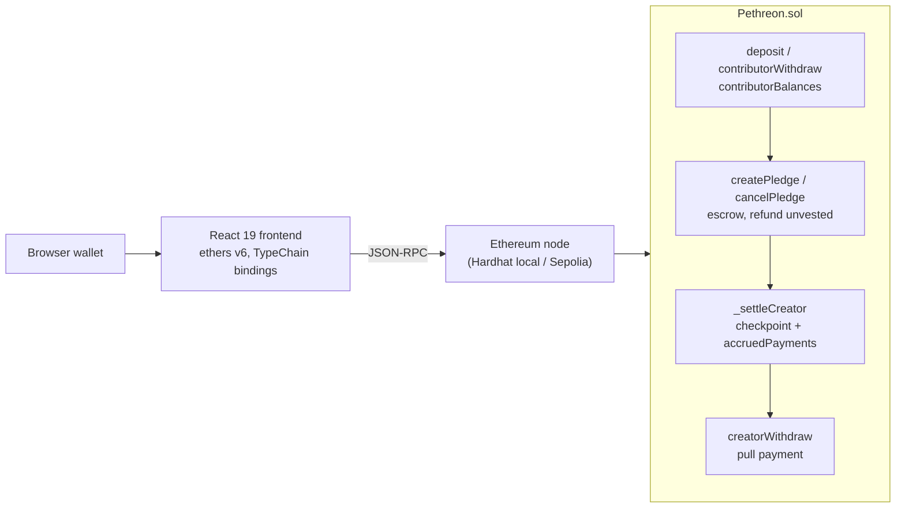

# Pethreon

A Patreon-style recurring-payments dapp on Ethereum. Contributors escrow ether
in a Solidity contract that releases it to a creator one period at a time, and
any unvested remainder is refunded if they cancel. Creators pull their earnings
whenever they like. Accounting uses a checkpoint/accumulator, so withdrawal gas
doesn't grow with elapsed time. There is a React 19 + ethers v6 frontend.
**Unaudited, testnet only.**



## Build, test, run

```sh
npm install        # also compiles the contract and installs frontend/ (pnpm)
npm test           # 24 Hardhat contract tests
npm run gas        # gas benchmark (scripts/gas.ts)
npm run verify     # contracts + frontend lint, typecheck, 62 Vitest tests, build
npm run dev        # local chain; then `npm run deploylh` and `npm run fdev`
```

See [docs/CONTRIBUTING.md](docs/CONTRIBUTING.md) for wallet setup, and
[docs/LEARN.md](docs/LEARN.md) for a guided tour of the code.

## Results

Measured on `z` (Apple M4 Mini, 10 cores, 16 GB) with `npm run gas` on the
in-process Hardhat network (Solidity 0.8.30, optimizer 200 runs, cancun),
2026-10-06. "Before" is commit `bc1c0d9`, which still used per-period payment
slots.

| Operation | Before | After |
| --- | ---: | ---: |
| `createPledge`, 30 periods | 1,019,911 | 365,737 |
| `createPledge`, 365 periods | 8,549,383 | 365,749 |
| `creatorWithdraw`, 100 periods idle | 330,723 | 256,559 |
| `creatorWithdraw`, 5,000 periods idle | 13,732,223 | 256,559 |

- Before: about 22,500 gas per pledged period and 2,735 gas per idle period.
  At a 30M block gas limit, no pledge could last more than about 1,300
  periods, and a creator who hadn't withdrawn for about 11,000 periods (30
  years daily, 15 months hourly) could never withdraw again.
- After: both costs are flat. The cost now scales with the creator's
  *active* pledges instead, about 5,400 gas each (68,052 gas with 1, 331,725
  with 50). See [known issue 6](docs/KNOWN_ISSUES.md).
  The 256k withdrawal figure includes retiring the matured pledge into the
  expired list. That is a one-time storage write per pledge.
- Tests: 24/24 contract tests, 62/62 frontend tests (`npm run verify`).

Known defects and their fixes: [docs/KNOWN_ISSUES.md](docs/KNOWN_ISSUES.md).

## Overview

[This dapp](https://github.com/chris56974/pethreon) is a decentralized crowdfunding application that runs on ethereum. It's similar to [Patreon](https://www.patreon.com/) except there's no third-parties. The backend is a modified/working version of [Sergei's Pethreon Smart Contract](https://github.com/s-tikhomirov/pethreon). The frontend is my own react project.

## Tech Stack

Backend uses [Solidity](https://docs.soliditylang.org/), [Hardhat](https://hardhat.org/), [Typechain](https://github.com/dethcrypto/TypeChain), [Infura](https://infura.io/).

Frontend uses [React](https://react.dev/), [Ethers](https://docs.ethers.org/v6/), [Motion](https://motion.dev/) (formerly Framer Motion), [Typescript](https://www.typescriptlang.org/), [OnboardJS](https://onboard.blocknative.com/), [Vite](https://vite.dev/), [Vitest](https://vitest.dev/), [ESlint](https://eslint.org/).

Styling is plain CSS — CSS Modules with native nesting and custom properties, no preprocessor.

The repo pins Node 24 LTS via [mise](https://mise.jdx.dev/) (`.mise.toml`).

The frontend was made with [these design mockups](https://www.figma.com/file/dwPfF2lhw84J4PZdZTIQvL/Pethreon?node-id=0%3A1).

## How does it work? 

### User Flow

In Pethreon, every user is a both "contributor" and a "creator". When a user signs in with their cryptowallet, they're immediately brought to the contributor page. From there, they can deposit funds into the Pethreon smart contract to accrue a balance. The user (as a contributor) can then "pledge" this balance to any creator of their choice so long as they know the creator's ethereum address. Each pledge is paid in full upfront by the contributor, payments are then spread out and sent to the creator periodically over a duration specified by the contributor. The contributor can cancel their pledge at any time to receive a refund for the remaining amount. 

To receive money as a creator, the user must navigate to the creator page. Unlike a traditional ethereum payment, the creator must know about this app to receive any payment. The advantages of using Pethreon are similar to that of Patreon, with a few twists. There is no personal data that you have to give up in order to use the app (besides your ethereum address). There are also no middle-men involved and no commissions (just gas fees). 

### How is it implemented?

I basically have a react app that talks to a remote server @ [Infura](https://infura.io/). This server is special in that it's also an "ethereum node", which means it can read and write data to the blockchain. Whenever my react app needs to do something with the Pethreon smart contract, it will reach out to this server to make it happen. 

My react app doesn't communicate via a library like axios though, it uses ethersJS which uses [JSON-RPC](https://en.wikipedia.org/wiki/JSON-RPC) (a protocol built on top of HTTP) under the hood. The "RPC" in JSON-RPC refers to the type of calls my react app can make when reaching out to my infura node `contract.example()`. And the JSON part refers to the output I get back whenever I compile my [Pethreon.sol](https://github.com/Chris56974/Pethreon/blob/main/packages/backend/contracts/Pethreon.sol) smart contract into a [Pethreon.json](https://github.com/Chris56974/Pethreon/blob/main/packages/backend/deployments/localhost/Pethreon.json) via the solc compiler (which is baked into hardhat). 

The pethreon.json file has two important pieces of information. The EVM "bytecode" for the smart contract, which is what I deploy to ethereum. And the "abi" for the smart contract, an instruction sheet that tells my react app how to use the smart contract (what functions exist). 

Some of those smart contract functions cost real money (like creating a pledge) because they require verification from every other node in the ethereum network ([~6,000 nodes](https://www.ethernodes.org/history)). Others require no verification at all and are otherwise free, subject to my agreement @ infura -> [I get 100,000 free calls a day](https://infura.io/pricing)). 

## [LICENSE](https://github.com/chris56974/pethreon/blob/main/LICENSE)

## Attribution

- [Sergei et al's Pethreon Smart Contract](https://github.com/s-tikhomirov/pethreon)

- [Cottonbro's Money Video - Aspect Ratio 256:135](https://www.pexels.com/video/hands-hand-rich-green-3943965/)

- [Artsy Cat's Cutesy Font](https://www.dafont.com/cutesy.font)

- [Sora Sagano's Aileron Font](https://fontsarena.com/aileron-by-sora-sagano/)

- [Sarah Fossheim's "Loading..." Animation](https://fossheim.io/writing/posts/react-text-splitting-animations/)

- [Fireship io's Framer Motion Modals](https://www.youtube.com/watch?v=SuqU904ZHA4&t=576s)

- [Håvard Brynjulfsen's Radio Button styles](https://codepen.io/havardob/pen/dyYXBBr)

- [Fluid Type Scale](https://www.fluid-type-scale.com/)

- [Metamask Logo](https://github.com/MetaMask/brand-resources)

- [Github logo](https://github.com/logos)

- [ionicons for the svgs](https://ionic.io/ionicons)
